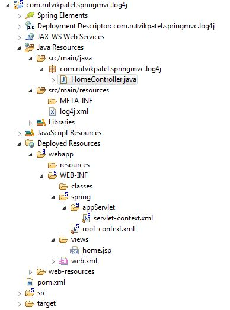
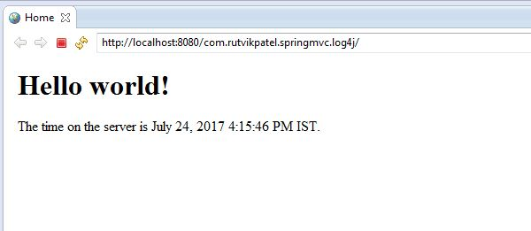

# springmvc-log4j
> Day 4 - Spring MVC Log4J Example

### Description
This is a simple Spring MVC Log4J example project.

### Release Steps In Eclipse

* Import as Maven Project
* Run As > Run On Server
* Go to below link

#### Links
> http://localhost:8080/com.rutvikpatel.springmvc.log4j/

### 1. Project Structure

### 2. Home Page

## Meta

Rutvik Patel - rrpatel003@gmail.com

Distributed under the GPL V3.0 license. See ``LICENSE`` for more information.
